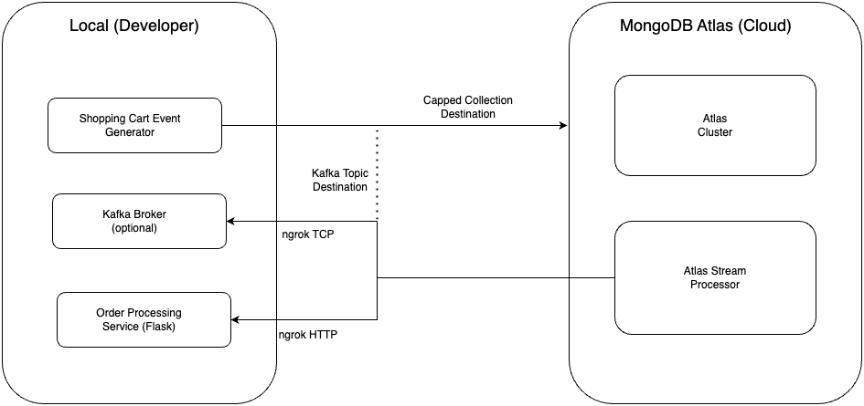

# Real-time Order Fulfillment Demo with MongoDB Atlas Stream Processor

## Table of Contents

* [Overview](#overview)
* [Key Features](#key-features)
* [Architecture](#architecture)
* [Prerequisites](#prerequisites)
* [Installation](#installation)
* [Usage](#usage)
* [Appendix](#appendix)
    * [A. Setting Up `ngrok` for Multiple Local Services](#a-setting-up-ngrok-for-multiple-local-services)
    * [B. Configuring Local Kafka for `ngrok` and ASP Compatibility](#b-configuring-local-kafka-for-ngrok-and-asp-compatibility)

## Overview

This application demonstrates a robust, real-time order fulfillment process built using MongoDB Atlas Stream Processor (ASP). It showcases how developers can build event-driven applications using ASP that interact with local services (like Kafka and HTTP-based APIs) exposed via tools like `ngrok`.

The demo features an event-driven architecture composed of three core services:

* **Shopping Cart Service:** Manages user shopping carts and generates events upon cart modifications.
* **Order Processing Service:** Receives order requests, handles inventory checks, and initiates order creation via an HTTP endpoint.
* **Shipment Service:** (Conceptual) Manages the shipment process and updates shipment statuses (represented by events).

A dedicated **Shopping Cart Event Generator** script simulates user interactions. It can publish events to either a Kafka topic or a MongoDB capped collection, configurable via a command-line argument.

**MongoDB Atlas Stream Processors** act as the central orchestrators. They process events from the generator and facilitate communication between the simulated Shopping Cart, the local Order Processing Service, and potentially a Shipment Service. This architecture exemplifies how ASP enables the development of highly reactive and scalable event-driven applications connecting cloud and local environments.

To provide comprehensive visibility, all services emit status events to a centralized **Order History database** in MongoDB Atlas. This allows users to easily retrieve a complete and chronological record of an order's lifecycle through simple queries.

This demo serves as a valuable, practical resource for developers seeking to understand and implement event-driven patterns integrating MongoDB Atlas services with local development tools.

## Key Features

* **Event-Driven Architecture:** Illustrates asynchronous communication and service coordination via events managed by Atlas Stream Processor.
* **Hybrid Cloud/Local Development:** Demonstrates ASP connecting to HTTP and Kafka services running locally via `ngrok`.
* **Configurable Event Source:** Supports event ingestion from both Apache Kafka topics and MongoDB capped collections.
* **Real-time Order Processing:** Simulates immediate order placement and subsequent processing via local service calls.
* **MongoDB Atlas Stream Processor Integration:** Showcases ASP's ability to react to diverse event streams and call external HTTPS endpoints.
* **Centralized Order History:** Provides a persistent and queryable record of all order-related status updates in MongoDB Atlas.
* **Clear Implementation:** Offers well-structured and commented Python code for easy understanding and adaptation.
* **Practical Use Case:** Presents a tangible and relevant example of real-time order fulfillment bridging cloud and local development.

## Architecture



The application employs an event-driven pattern where Atlas Stream Processors mediate interactions.

1.  **Event Generation:** The `shopping_cart_event_generator.py` script simulates user actions, sending events to either a MongoDB capped collection or a Kafka topic.
2.  **ASP Processing:**
    * An Atlas Stream Processor listens to the MongoDB collection or Kafka topic.
    * Upon receiving a new cart event, it triggers a call to the Order Processing Service.
3.  **Order Processing Service (Local):**
    * This Flask service runs locally on port 5002.
    * `ngrok` exposes this service via a public HTTPS URL.
    * ASP calls this `ngrok` URL to submit the order.
    * The service processes the order (e.g., checks inventory) and writes status updates to the Order History database in Atlas.
4.  **Order History:** All significant status changes from various stages are recorded in the `orderhistorydb.order_history` collection in Atlas for auditing and user visibility.

## Prerequisites

* **MongoDB Atlas Account:** Required with a configured M0 or higher cluster.
    * **Region:** Create the cluster in a region supporting Atlas Stream Processing (check current AWS/Azure region availability).
    * **Database User:** A database user with read/write privileges to the required databases.
    * **Atlas Project API Keys:** Programmatic API keys (Public and Private) for your Atlas project with appropriate permissions (e.g., Project Owner or specific roles allowing management of Stream Processing instances and connections).
* **MongoDB Atlas Stream Processing:** Ensure the feature is available/enabled in your Atlas project.
* **Python:** Version 3.12 or later.
* **MongoDB Shell (`mongosh`) or MongoDB Compass:** For interacting with your Atlas cluster.
* **`ngrok`:** To create secure public URLs for your local Order Processing Service and Kafka broker. See Appendix for setup.
* **(Optional) Local Kafka Instance:** Required if running the demo with Kafka as the event source. A single-node setup is sufficient. See Appendix for configuration details for `ngrok` compatibility.

## Installation

Follow these steps to set up the demo environment:

1.  **Clone the Repository:**
    ```bash
    git clone [https://github.com/mongautam/demo-apps.git](https://github.com/mongautam/demo-apps.git)
    cd demo-apps/atlas-stream-processing/order-fulfillment-demo # Adjust path as needed
    ```
    *(Replace path if the directory structure is different)*

2.  **Set Up Python Virtual Environment (Recommended):**
    ```bash
    python3 -m venv venv
    source venv/bin/activate  # On macOS/Linux
    # venv\Scripts\activate   # On Windows
    ```

3.  **Install Dependencies:**
    ```bash
    pip install -r requirements.txt
    ```

4.  **Set up `ngrok`:**
    * Download and install `ngrok` from [https://ngrok.com/](https://ngrok.com/).
    * Authenticate your `ngrok` client using the command provided on your `ngrok` dashboard after signing up.
    * Configure `ngrok` to expose your local services (HTTP for the order service, TCP for Kafka if used). Using an `ngrok.yaml` configuration file is recommended for managing multiple tunnels. See the **Appendix** for detailed instructions.

5.  **Configure Environment Variables:**
    * Copy the provided environment file template:
        ```bash
        cp env .env
        ```
    * Open the `.env` file in a text editor and **replace all placeholder values** (`REPLACE_WITH_...`) with your actual credentials and configuration details.

    ```dotenv
    # MongoDB Atlas User Credentials
    MONGO_USER="REPLACE_WITH_MONGODB_USER_NAME"
    MONGO_PASS="REPLACE_WITH_MONGODB_PASSWORD"

    # Atlas Project and Cluster Details
    ATLAS_PROJECT_ID="REPLACE_WITH_ATLAS_PROJECT_ID"
    ATLAS_CLUSTER_NAME="REPLACE_WITH_ATLAS_CLUSTER_NAME"
    # Example: mycluster.ab12cde.mongodb.net
    MONGO_URL="REPLACE_WITH_CLUSTER_URL_WITHOUT_SCHEMA"
    # Full connection string (usually derived, but ensure accuracy)
    MONGO_FULL_URL="mongodb+srv://${MONGO_USER}:${MONGO_PASS}@${MONGO_URL}/?retryWrites=true&w=majority&appName=${ATLAS_CLUSTER_NAME}"

    # Atlas API Keys (ensure they have sufficient permissions)
    ATLAS_API_PUBLIC_KEY="REPLACE_WITH_ATLAS_API_PUBLIC_KEY"
    ATLAS_API_PRIVATE_KEY="REPLACE_WITH_ATLAS_API_PRIVATE_KEY"

    # Atlas Stream Processing Details
    STREAM_PROCESSOR_INSTANCE_NAME="fulfillmentServiceStreamProcessorInstance"
    # Example: sp-abcde-dev.cloud.mongodb.com (Find in Atlas UI)
    ATLAS_STREAM_PROCESSOR_URL="REPLACE_WITH_ATLAS_STREAM_PROCESSOR_URL"

    # Local Order Processing Service URL (from ngrok)
    # Example: [https://your-unique-id.ngrok-free.app](https://your-unique-id.ngrok-free.app)
    ORDER_SERVICE_URL="REPLACE_WITH_HTTPS_URL_FROM_NGROK_FOR_PORT_5002"

    # Kafka Configuration (Only needed if using Kafka event source)
    # Example: 0.tcp.ngrok.io:12345 (from ngrok TCP tunnel)
    KAFKA_BOOTSTRAP_SERVERS="REPLACE_WITH_KAFKA_TCP_ADDRESS_FROM_NGROK"
    # Credentials matching your kafka_server_jaas.conf (see Appendix)
    KAFKA_USERNAME="admin" # Or your configured username
    KAFKA_PASSWORD="admin-secret" # Or your configured password
    KAFKA_SHOPPING_CART_TOPIC="shopping-cart-events"

    # Database and Collection Names (Defaults are usually fine)
    SHOPPING_CART_DB_NAME="shoppingcartdb"
    SHOPPING_CART_COLLECTION_NAME="incoming_shopping_cart_events"
    ```

    **Important:** Ensure the `ORDER_SERVICE_URL` and `KAFKA_BOOTSTRAP_SERVERS` correctly reflect the public URLs/addresses provided by `ngrok` *after* you start it in the Usage steps.

## Usage

Follow these steps to run the demo application:

1.  **Start `ngrok`:**
    Open a dedicated terminal and start `ngrok` to expose your local ports. If using the recommended configuration file (see Appendix):
    ```bash
    ngrok start --all
    ```
    Note the **HTTPS URL** for the `order` service (port 5002) and the **TCP address** for the `shopping-cart-kafka` service (port 9092). Update `ORDER_SERVICE_URL` and `KAFKA_BOOTSTRAP_SERVERS` in your `.env` file with these values.

2.  **Export Environment Variables:**
    Load the variables from your `.env` file into your current shell session (ensure you are in the project directory with the activated virtual environment):
    ```bash
    export $(grep -v '^#' .env | xargs)
    # Or use: set -a; source .env; set +a
    ```
    *Verify a few variables were set:*
    ```bash
    echo $MONGO_USER
    echo $ORDER_SERVICE_URL
    ```

3.  **Start the Local Order Processing Service:**
    Open another terminal (with the virtual environment activated) and run the Flask application:
    ```bash
    python order_processing_service.py
    ```
    *Keep this terminal running. You should see log output here when ASP calls the service.*

4.  **Create Databases and Collections in Atlas:**
    Run the setup script (in your primary terminal with env vars set):
    ```bash
    python create_db_collections.py
    ```
    *Verify the `shoppingcartdb` and `orderhistorydb` databases (and initial collections) appear in your Atlas cluster using Atlas UI, `mongosh`, or Compass.*

5.  **Create the Stream Processor Instance:**
    ```bash
    python create_stream_processor_instance.py
    ```
    *Verify the instance (`fulfillmentServiceStreamProcessorInstance` or your chosen name) appears in the Atlas UI under Stream Processing.*

6.  **Create Stream Processor Connections:**
    This script creates connections needed by the processors (e.g., to Kafka, to the Order Service HTTP endpoint).
    ```bash
    python create_stream_processor_connections.py
    ```
    *Verify the connections (e.g., `kafkaConnection`, `orderServiceConnection`) appear under the Stream Processing instance in the Atlas UI.*

7.  **Create and Start Stream Processors:**
    ```bash
    python create_stream_processors.py
    ```
    This script defines the stream processing logic. After running the script, **go to the Atlas UI** -> Stream Processing -> Your Instance -> Processors tab:
    * **Start** the `shoppingCartEventsFromMongoDBStreamProcessor`.
    * **Start** the `orderHistoryFromMongoDBStreamProcessor`.
    * **Do NOT start** `shoppingCartEventsFromKafkaStreamProcessor` yet, unless you only intend to test with Kafka initially.

8.  **Run Event Generator (MongoDB Source):**
    Simulate shopping cart events being written to the capped collection:
    ```bash
    python shopping_cart_event_generator.py --destination mongodb
    ```
    *Observe:*
    * Incoming requests logged in the `order_processing_service.py` terminal.
    * Documents appearing in the `orderhistorydb.order_history` collection in Atlas.
    * Metrics/logs in the Atlas Stream Processing UI for the running processors.

9.  **(Optional) Run Event Generator (Kafka Source):**
    * Ensure your local Kafka broker is running and configured as described in the Appendix.
    * Ensure `ngrok` is running and the `KAFKA_BOOTSTRAP_SERVERS` in `.env` points to the `ngrok` TCP address.
    * In the Atlas UI, **Stop** the `shoppingCartEventsFromMongoDBStreamProcessor`.
    * In the Atlas UI, **Start** the `shoppingCartEventsFromKafkaStreamProcessor`.
    * Run the event generator, specifying Kafka as the destination:
        ```bash
        python shopping_cart_event_generator.py --destination kafka
        ```
    *Observe:*
    * Similar activity as with the MongoDB source (logs, data in Atlas, ASP metrics).

10. **Retrieve Order History:**
    Query the history for a specific order ID (find an ID from the `order_history` collection or the generator output):
    ```bash
    python get_order_history.py <order_id>
    ```
    Replace `<order_id>` with an actual ID.
    ```bash
    # Example:
    python get_order_history.py ae7207c4-8077-4eca-a9b3-a6a52ea75a40
    ```
    The script will fetch and print the status history for that order from the `order_history` collection.

## Appendix

### A. Setting Up `ngrok` for Multiple Local Services

When integrating local development services with cloud platforms like MongoDB Atlas Stream Processor (ASP), you need a way to securely expose your local endpoints. `ngrok` creates secure tunnels from public URLs/addresses to your local machine.

**Why `ngrok` is Necessary:**

1.  **ASP HTTPS Requirement:** ASP requires connections to external HTTP services to use HTTPS with valid (not self-signed) certificates. `ngrok` provides this for your local HTTP service.
2.  **ASP Kafka Protocol Support:** ASP can connect to Kafka using `SASL_PLAINTEXT` or `SASL_SSL` security protocols. It **cannot** connect using the standard plain `PLAINTEXT` protocol without SASL. `ngrok` can create a TCP tunnel for Kafka, and you must configure Kafka and the ASP connection to use SASL over this tunnel.
3.  **Secure Tunneling:** `ngrok` handles the complexity of creating secure, publicly accessible endpoints for your local services.

**Recommended Setup: `ngrok.yaml` Configuration File**

Using a configuration file (`ngrok.yaml`) is the easiest way to manage multiple tunnels.

1.  **Locate/Create `ngrok.yaml`:**
    * **macOS:** `~/Library/Application Support/ngrok/ngrok.yaml`
    * **Linux:** `~/.config/ngrok/ngrok.yaml` or `~/.ngrok2/ngrok.yaml`
    * **Windows:** `%HOMEPATH%\AppData\Local\ngrok\ngrok.yaml`
    * *Tip:* Run `ngrok config edit` to open it directly.

2.  **Edit `ngrok.yaml`:** Add the following configuration, replacing `YOUR_AUTH_TOKEN_FROM_NGROK` with your actual token from the `ngrok` dashboard.

    ```yaml
    version: "3"
    authtoken: YOUR_AUTH_TOKEN_FROM_NGROK # Replace with your ngrok auth token
    tunnels:
      # Tunnel for the local Order Processing HTTP service
      order:
        proto: http
        addr: 5002 # Port your order_processing_service.py runs on

      # Tunnel for the local Kafka broker
      shopping-cart-kafka:
        proto: tcp
        addr: 9092 # Default Kafka port your broker listens on (SASL_PLAINTEXT)
    ```

3.  **Start `ngrok`:** Open a terminal and run:
    ```bash
    ngrok start --all
    ```
    `ngrok` will start tunnels for `order` and `shopping-cart-kafka`.

4.  **Get Public Endpoints:** The `ngrok` terminal output will show:
    * An **HTTPS URL** for the `order` tunnel (e.g., `https://random-subdomain.ngrok-free.app`). Use this as `ORDER_SERVICE_URL` in your `.env` file.
    * A **TCP Address** for the `shopping-cart-kafka` tunnel (e.g., `tcp://0.tcp.us-west.ngrok.io:12345`). Use the address and port (e.g., `0.tcp.us-west.ngrok.io:12345`) as `KAFKA_BOOTSTRAP_SERVERS` in your `.env` file.

5.  **Keep `ngrok` Running:** Leave the `ngrok` process running in its terminal while you are using the demo.

### B. Configuring Local Kafka for `ngrok` and ASP Compatibility

To allow Atlas Stream Processor (ASP) to connect to your local Kafka instance via the `ngrok` TCP tunnel, you need to configure Kafka to:

1.  Listen using a SASL protocol (ASP supports `SASL_PLAINTEXT` or `SASL_SSL`, but not plain `PLAINTEXT`).
2.  Advertise the `ngrok` public TCP address so clients (like ASP) know how to connect *through* `ngrok`.

**Steps:**

1.  **Create JAAS Configuration File:** Create a file named `kafka_server_jaas.conf` (e.g., in Kafka's `config` directory) with simple username/password credentials for the `PLAIN` mechanism:

    ```ini
    # config/kafka_server_jaas.conf
    KafkaServer {
      org.apache.kafka.common.security.plain.PlainLoginModule required
      username="admin"
      password="admin-secret"
      user_admin="admin-secret"; # You can define multiple user_... entries
    };
    ```
    *(Ensure the `KAFKA_USERNAME` and `KAFKA_PASSWORD` in your `.env` file match these credentials.)*

2.  **Set JAAS Environment Variable:** Tell the Kafka broker where to find this file by setting an environment variable **before** starting Kafka:
    ```bash
    export KAFKA_OPTS="-Djava.security.auth.login.config=/path/to/your/kafka/config/kafka_server_jaas.conf"
    ```
    *(Replace `/path/to/your/kafka/config/` with the actual path)*

3.  **Modify `server.properties`:** Edit your Kafka broker's main configuration file (`config/server.properties`):

    ```properties
    # --- Listener Configuration ---
    # Listen locally on port 9092 using SASL_PLAINTEXT
    listeners=SASL_PLAINTEXT://localhost:9092

    # Tell clients (like ASP via ngrok) to connect to the ngrok public address
    # REPLACE 0.tcp.ngrok.io:12345 with the *actual* TCP address from 'ngrok start --all'
    advertised.listeners=SASL_PLAINTEXT://0.tcp.ngrok.io:12345

    # --- SASL Configuration ---
    sasl.mechanism.inter.broker.protocol=PLAIN # Or match client mechanism if needed
    sasl.enabled.mechanisms=PLAIN

    # If using KRaft mode, ensure controller listener is configured separately
    # Example: controller.listener.names=CONTROLLER
    # Example: listener.security.protocol.map=CONTROLLER:PLAINTEXT,SASL_PLAINTEXT:SASL_PLAINTEXT
    # Example: listeners=SASL_PLAINTEXT://localhost:9092,CONTROLLER://localhost:9093
    # Example: advertised.listeners=SASL_PLAINTEXT://0.tcp.ngrok.io:12345,CONTROLLER://localhost:9093

    # Other required settings like broker.id, log.dirs, zookeeper.connect (if using ZK) etc.
    # ...
    ```
    **Crucially, update `advertised.listeners` with the correct `ngrok` TCP address and port *after* you start `ngrok`**. You might need to restart Kafka if the `ngrok` address changes.

4.  **Start Kafka Broker:** Start your Kafka broker using the standard scripts (e.g., `bin/kafka-server-start.sh config/server.properties`), ensuring the `KAFKA_OPTS` environment variable is set.

5.  **Create Kafka Topic (Using SASL):**
    You'll need client configuration properties to interact with the SASL-enabled broker. Create a client properties file (e.g., `config/client.properties`):

    ```properties
    # config/client.properties
    security.protocol=SASL_PLAINTEXT
    sasl.mechanism=PLAIN
    sasl.jaas.config=org.apache.kafka.common.security.plain.PlainLoginModule required \
      username="admin" \
      password="admin-secret";
    ```

    Now create the topic using the **`ngrok` address** and the client config:
    ```bash
    # Replace NGROK_TCP_ADDRESS with the actual address (e.g., 0.tcp.ngrok.io:12345)
    bin/kafka-topics.sh --create \
      --topic shopping-cart-events \
      --bootstrap-server NGROK_TCP_ADDRESS \
      --command-config config/client.properties
    ```

6.  **(Optional) Test with Console Producer/Consumer:**
    Use the client properties file to test sending/receiving messages via `ngrok`:
    ```bash
    # Producer (Replace NGROK_TCP_ADDRESS)
    bin/kafka-console-producer.sh \
      --topic shopping-cart-events \
      --bootstrap-server NGROK_TCP_ADDRESS \
      --producer.config config/client.properties

    # Consumer (In a separate terminal, replace NGROK_TCP_ADDRESS)
    bin/kafka-console-consumer.sh \
      --topic shopping-cart-events \
      --bootstrap-server NGROK_TCP_ADDRESS \
      --consumer.config config/client.properties \
      --from-beginning
    ```

By following these steps, your local Kafka instance will be accessible to Atlas Stream Processor through the secure `ngrok` tunnel using `SASL_PLAINTEXT`. Remember to keep both `ngrok` and your Kafka broker running during the demo.